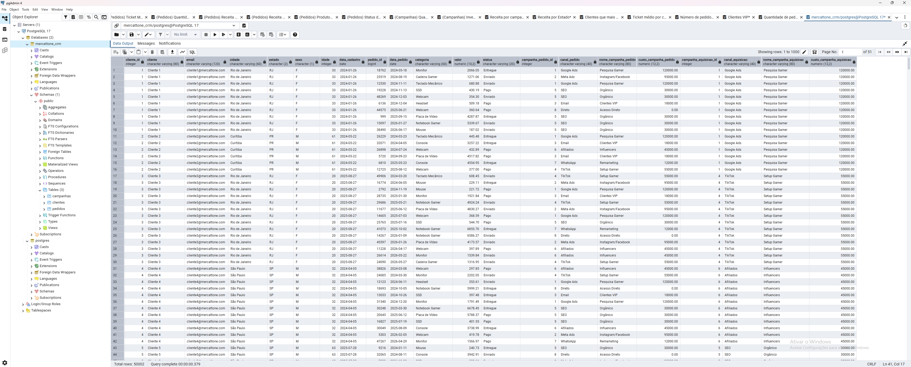
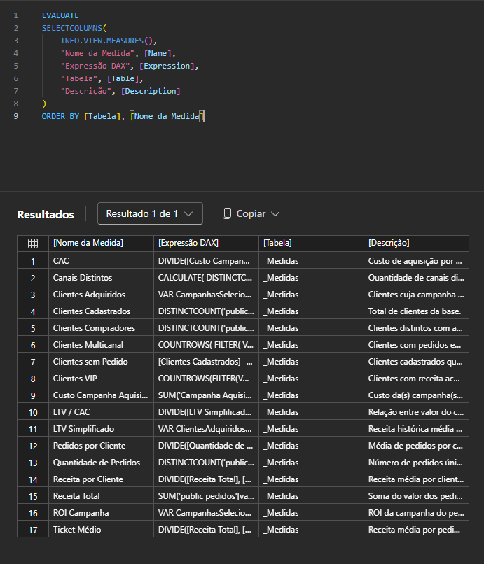
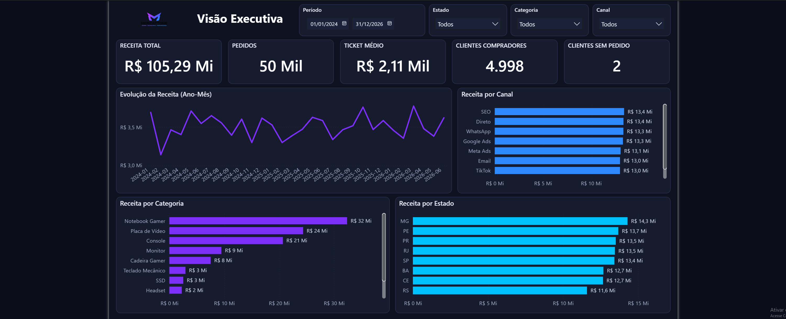
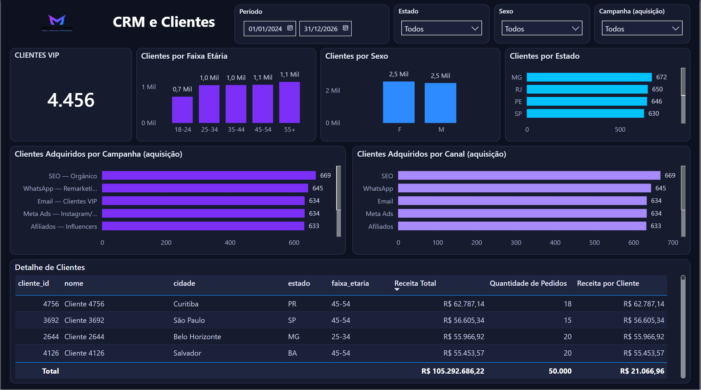
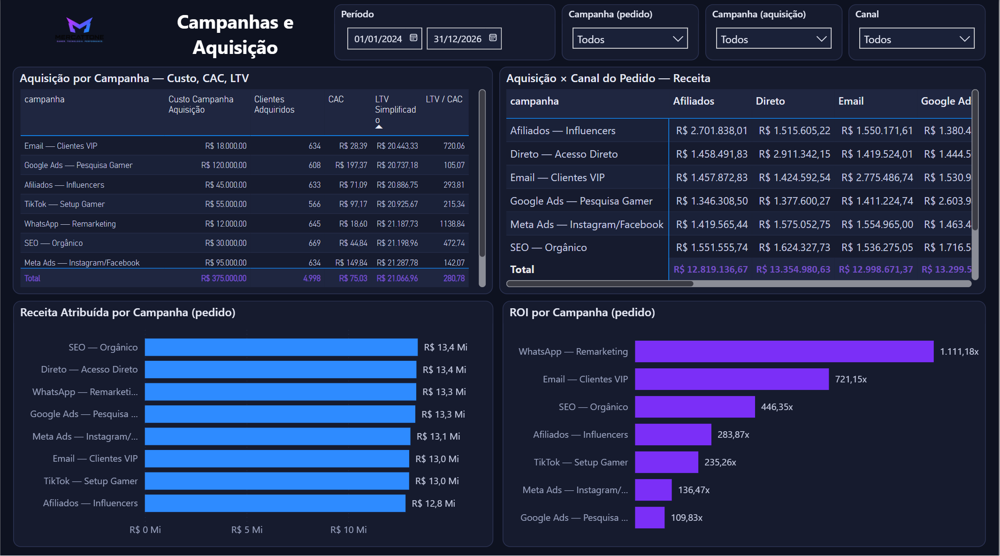
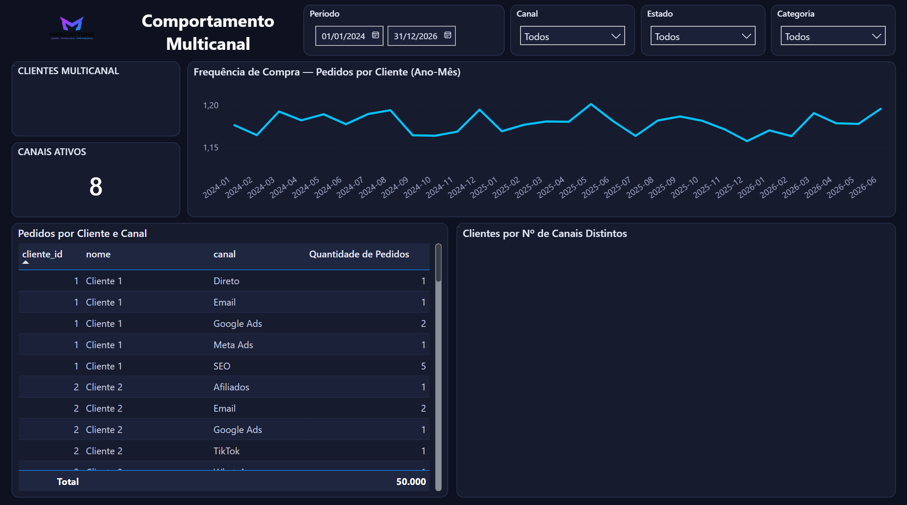

# Case Mercattone — PostgreSQL · DAX · Power BI

Projeto completo de analytics para um **e-commerce gamer fictício**: modelagem e carga do banco relacional em **PostgreSQL**, criação de **17 medidas DAX** e construção de um **dashboard executivo de 4 páginas no Power BI** — com IA integrada ao processo de modelagem e design.

🔗 **Página do projeto:** [nicksla593.github.io/Projeto-Dashboard-CRM-PostgreSQL](https://nicksla593.github.io/Projeto-Dashboard-CRM-PostgreSQL/)

> **Foco profissional:** CRM & Operações — análise de aquisição de clientes, performance de campanhas, segmentação e comportamento multicanal.

---

## Stack

| Camada | Tecnologia |
|--------|-----------|
| Banco de dados | PostgreSQL 17 (pgAdmin 4) |
| Camada semântica | DAX (tabela dedicada `_Medidas`) |
| Visualização | Power BI |
| IA no fluxo | ChatGPT (modelagem e DAX) · Claude integrado ao Power BI (design visual) |

---

## Etapa 01 · Banco de dados (PostgreSQL)

Banco transacional `mercattone_crm` simulando a operação de um e-commerce gamer, com 3 tabelas integradas por chaves estrangeiras:

| Tabela | Registros | Descrição |
|--------|-----------|-----------|
| `campanhas` | 8 | Campanhas de mídia (Google Ads, Meta, TikTok, SEO, Email, Afiliados, WhatsApp, Direto) com custo de investimento |
| `clientes` | 5.000 | Perfil demográfico (cidade, estado, sexo, idade) + campanha de aquisição (FK) |
| `pedidos` | 50.000 | Transações com data, categoria, valor, status + FKs para cliente e campanha |

**Relacionamentos:**
- `clientes.campanha_aquisicao_id` → `campanhas.campanha_id` (campanha que trouxe o cliente)
- `pedidos.cliente_id` → `clientes.cliente_id`
- `pedidos.campanha_id` → `campanhas.campanha_id` (canal do pedido)



> Dados 100% sintéticos, gerados para fins de estudo.

---

## Etapa 02 · Métricas DAX

Camada semântica com **17 medidas** organizadas em tabela dedicada (`_Medidas`), documentadas com descrição individual:

**Receita & Vendas**
`Receita Total` · `Quantidade de Pedidos` · `Ticket Médio` · `Receita por Cliente` · `Pedidos por Cliente`

**Aquisição & Marketing**
`CAC` · `LTV Simplificado` · `LTV / CAC` · `ROI Campanha` · `Custo Campanha Aquisição` · `Clientes Adquiridos`

**CRM & Comportamento**
`Clientes Cadastrados` · `Clientes Compradores` · `Clientes sem Pedido` · `Clientes VIP` · `Clientes Multicanal` · `Canais Distintos`

Além das medidas: tabela calendário (`dCalendario`) com granularidade diária e coluna `Ano-Mês`, e coluna derivada `faixa_etaria` em clientes para segmentação demográfica.



---

## Etapa 03 · Dashboard Power BI

Relatório executivo em **4 páginas**, cada uma respondendo a uma pergunta de negócio, com filtros de período, estado, categoria e canal:

### 📊 Página 01 — Visão Executiva
KPIs consolidados: **R$ 105,29 Mi** de receita, 50 mil pedidos, ticket médio, evolução mensal da receita e quebras por canal, categoria e estado.



### 👥 Página 02 — CRM e Clientes
Base segmentada por faixa etária, sexo e geografia; clientes VIP; aquisição por campanha e canal; tabela detalhada com receita e pedidos por cliente.



### 📣 Página 03 — Campanhas e Aquisição
Análise de eficiência de mídia: custo, CAC, LTV Simplificado e **LTV/CAC por campanha**; matriz aquisição × canal do pedido; receita atribuída e **ROI por campanha** (destaque: WhatsApp Remarketing com 1.111x).



### 🔀 Página 04 — Comportamento Multicanal
Frequência de compra ao longo do tempo, pedidos por cliente e canal, e distribuição de clientes por número de canais distintos utilizados.



---

## Arquivos do repositório

```
Projeto-Dashboard-CRM-PostgreSQL/
├── README.md
├── index.html                  → página do projeto (GitHub Pages)
├── mercattone-banco.sql        → dump completo do banco (schema + dados)
├── Dashboard_Mercattone.pbix   → dashboard Power BI
└── prints/                     → capturas do banco, medidas e dashboard
```

### Como reproduzir

**Banco:** crie um database no PostgreSQL e restaure o dump:
```bash
psql -U postgres -d mercattone_crm -f mercattone-banco.sql
```

**Dashboard:** abra o `Dashboard_Mercattone.pbix` no Power BI Desktop e aponte a conexão para o seu PostgreSQL local (host, porta, database e credenciais próprias).

---

## Sobre

Projeto de estudo desenvolvido como prática de modelagem de dados, DAX e visualização, com IA como copiloto em todas as etapas — aplicável a operações de CRM, marketing e e-commerce.

**Contato:** Nicolas Vannucci Barbosa · [LinkedIn](https://www.linkedin.com/in/nicolas-vannucci-barbosa-414235338/) · [nickvannucci2013@gmail.com](https://mail.google.com/mail/?view=cm&fs=1&to=nickvannucci2013@gmail.com)
